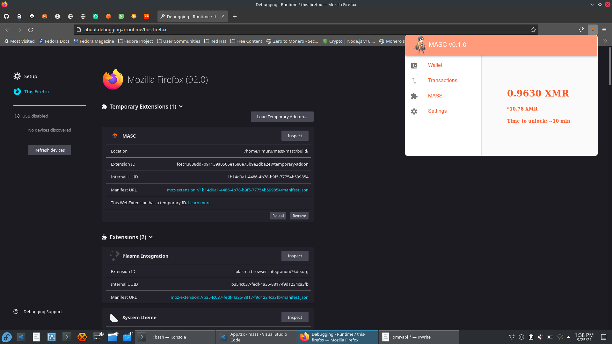

# MASC

[ POC / WIP ] Monero Anonymous Swaps Client

Lightweight Monero wallet and browser extension for quick interface with
monero-wallet-rpc and and Monero Anonymous Swaps Server. Test bed for 
bleeding edge features (consensus wallet, swaps, etc.)

## MASC-Proxy

A Node.js typescript server that facilitates React <-> Monero RPC

* proxy must run before the UI
* `cd masc-proxy && npm run clean && npm run build && node dist/proxy.js`
* If you want to use an existing wallet in development:
    * set `REACT_APP_MASC_DEV=DEV` in `.env.local`
    * This will override wallet initialization.

## Development

* start the client with `cd ../masc && npm start`
* should open react on localhost:3000

## Building

* build browser extension with `npm run build`
* open Firefox (other browsers pending)
* type `about:debugging` into the url input
* click "This Firefox" on the left hand side
* Install temporary add-on from `$HOME/mass/masc/build/index.html`

